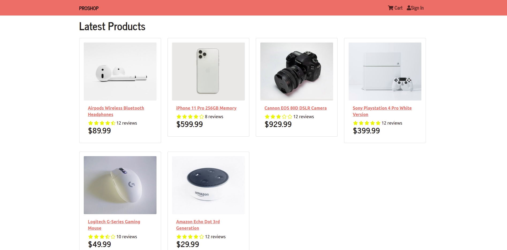
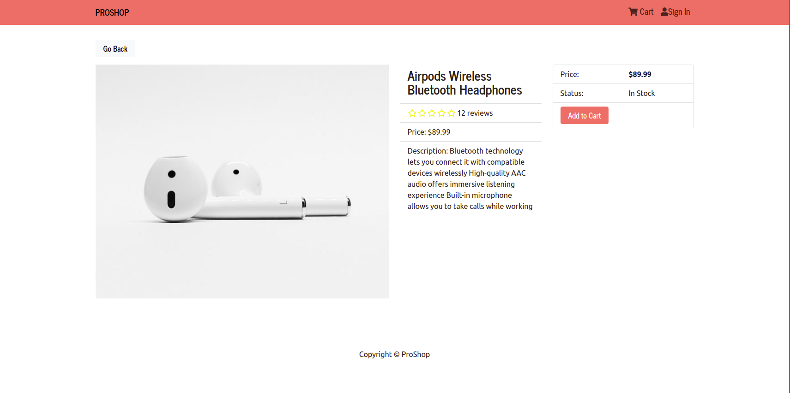
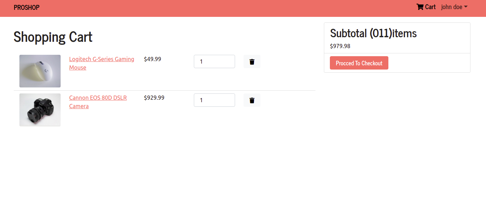
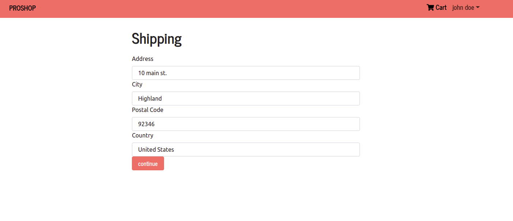
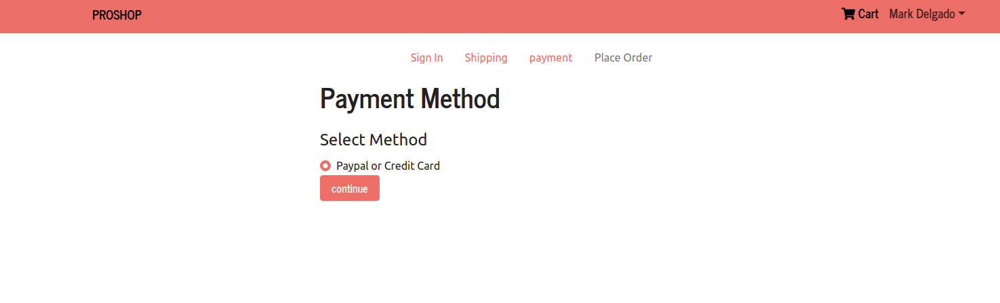
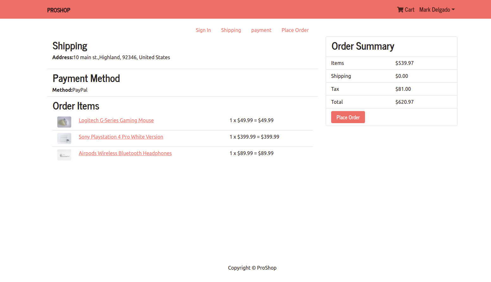
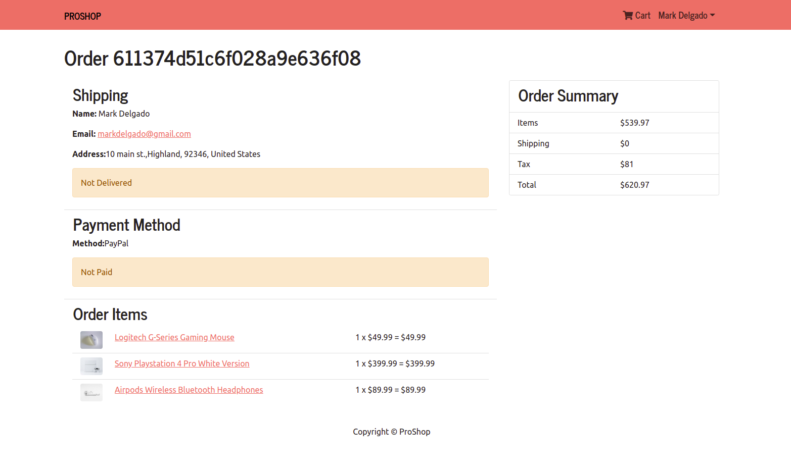
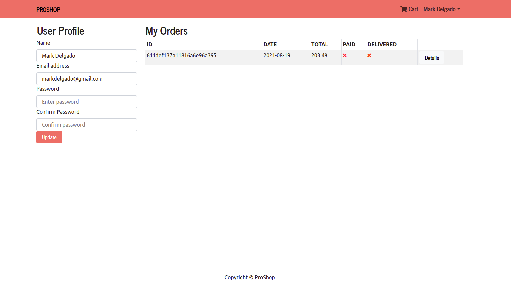

# ProShop-webpage

## Description
The project is a full-stack web application of e-commerce webpage with  
## Table of Contents
* [Usage](#usage)
* [Screenshots](#screenshots)
* [Technologies-used](#technologies-used)

## Usage
Proshop is a e-commerce webpage that allows the user to buy products uploaded by the admin. The admin has the ability to upload products and quantity with a detailed description and photo of the prodcut.

## Technologies-used
Proshop uses React and redux for the frontend and node and mongoDB for the backend.

## Screenshots

